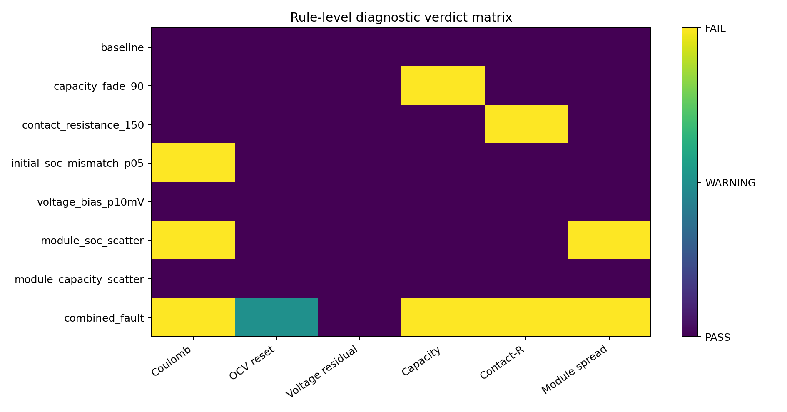
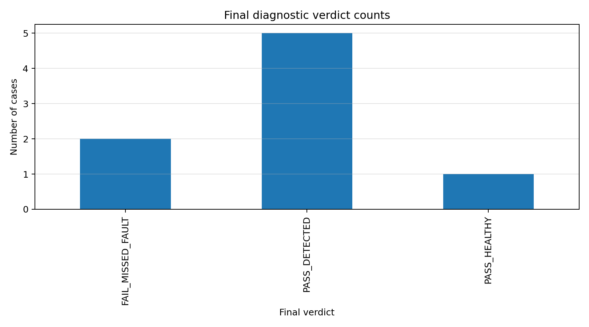

# Battery Diagnostic Robustness Demonstrator

A signal-to-state diagnostic audit pipeline for evaluating SOC/SOH-related
diagnostic algorithm response under controlled parameter perturbations,
sensor-layer deviations, and cell-to-cell scatter in series-cluster
topologies.

## What this is

This repository instantiates a methodological observation:

> An observable signal does not uniquely determine the underlying physical
> state.

Translated to battery diagnostics:

> A sensor signal is not necessarily equivalent to a physical fault
> identity.

v0.1 is a synthetic demonstrator that exercises this idea across an
eight-case matrix of cell-level and module-level parameter perturbations
fed into six rule-based diagnostic checks.

## Scope

v0.1 covers:

- 24s1p pure-series virtual battery module
- Synthetic profiles via 1RC equivalent circuit model
- OCV–SOC table pre-derived from the PyBaMM Chen2020 parameter set as
  one-time offline static reference data
- Eight controlled cases (cell-level fault, sensor-layer deviation,
  module-level scatter, combined fault, healthy reference)
- Six demonstrator-level rule-based diagnostic checks
- Manually curated observability matrix
- Three CSV reports and summary plots

v0.1 does **not** include:

- Runtime PyBaMM coupling
- Model-based observers such as EKF or UKF
- CAN-layer replay or hardware co-simulation
- Parallel pack solver, current redistribution, or thermal coupling

The full v0.1 contract — framing, ECM choice, baseline parameters,
nomenclature, rule definitions, and roadmap rationale — is documented in
[`docs/methodology_decisions.md`](docs/methodology_decisions.md).

## Quick start

```bash
git clone https://github.com/jiaxingLu/battery-diagnostic-robustness-demo
cd battery-diagnostic-robustness-demo

# Install runtime dependencies (numpy, pandas, scipy, matplotlib)
python3 -m pip install -e .

# Run the end-to-end report pipeline
python3 -m bdr_demo.pipeline

# Optional: install dev dependencies and run regression tests
python3 -m pip install -e ".[dev]"
python3 -m pytest -q
```

A successful pipeline run writes three CSV reports to `reports/` and a
set of summary plots to `reports/plots/`.

## What v0.1 demonstrates

The eight cases span five perturbation classes:

| Class | Cases |
|---|---|
| Healthy reference | `baseline` |
| Cell-level fault | `capacity_fade_90`, `contact_resistance_150`, `initial_soc_mismatch_p05` |
| Sensor-layer deviation | `voltage_bias_p10mV` |
| Module-level scatter | `module_soc_scatter`, `module_capacity_scatter` |
| Combined fault | `combined_fault` |

Two cases are deliberately constructed as **ambiguity cases** that the
rule-based pipeline does not detect, exposing two distinct physical
sources of diagnostic blind spots:

- **`voltage_bias_p10mV`** — a +10 mV measurement bias sits below the
  30 mV voltage-residual warning threshold. The signal-residual rule
  alone cannot flag it.
- **`module_capacity_scatter`** — ±5 % cell-to-cell capacity scatter
  under a 600 s, 1 A prescribed-current discharge produces sub-30 mV
  module voltage spread. The module-imbalance rule cannot flag it
  within this short cycle.

Both cases yield `FAIL_MISSED_FAULT` in the case-level final verdict.
The remaining six cases yield `PASS_HEALTHY` (baseline) or
`PASS_DETECTED` (faults that activate at least one rule whose signature
is consistent with the injected fault label).





## Reports

`reports/` contains the three v0.1 deliverable artifacts:

| File | Content |
|---|---|
| `diagnostic_robustness_report.csv` | Per-case six-rule metrics, six-rule verdicts, false-positive/false-negative flags, and final verdict |
| `module_inconsistency_report.csv` | Per-case pack and cell voltage extrema, weakest-cell identification, module risk flag |
| `observability_matrix.csv` | Manually curated fault → signature mapping with three-tier ambiguity classification |

`reports/plots/` contains the two summary plots shown above. Per-metric
bar charts are regenerated on each pipeline run and not tracked in git.

## Roadmap

| Version | Scope |
|---|---|
| **v0.1** (current) | Synthetic 1RC profiles, 24s1p series module, six rule-based diagnostics, three CSV reports, manually curated observability matrix |
| v0.2 | PyBaMM SPMe profile bridge, 1RC ECM fitted from PyBaMM HPPC simulations |
| v0.3 | Bridge to `battery-testbench-simulator` via CSV interface, reuse of message-layer verifier |
| v0.4 | Automated observability matrix; EKF / UKF or comparable model-based observer benchmarks |

## Repository lineage

This demonstrator builds on three predecessor projects, each
instantiating the same methodological observation in a different domain:

- [`pybamm-dcac-superimposed`](https://github.com/jiaxingLu/pybamm-dcac-superimposed)
  — PyBaMM-based simulation parent project; source of the
  event-vs-state and signal-vs-state framing used in this demonstrator.
  The OCV–SOC table used here is exported from this project's PyBaMM
  Chen2020 parameter set.
- [`battery-testbench-simulator`](https://github.com/jiaxingLu/battery-testbench-simulator)
  — message-layer BMS testing framework. The raw-trace versus
  CAN-quantised-trace separation pioneered there informs the
  signal-to-state framing used here. v0.3 will bridge profile CSVs into
  its provider interface; no code is forked.
- [`battery-charging-analysis`](https://github.com/jiaxingLu/battery-charging-analysis)
  — experimental-analysis tools (Δt(Q), Π/κ framework). Conceptually
  related; no direct code dependency.

The thread linking all four projects is the methodological observation
that **observable signals do not uniquely determine the underlying
physical state**. Each project instantiates this observation in a
different domain.

## License

To be added.
